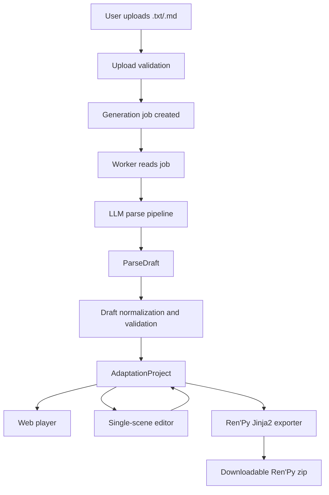

# Novel to Galgame MVP Design

## 1. Goal

Build a Web-first tool that turns an uploaded text novel into a playable visual novel demo. The first release focuses on a 10-20 minute interactive demo, not a full novel conversion.

The product serves two user groups:

- Novel authors who want to see their story adapted into an interactive format.
- AI content users who want a fast playable demo from a novel-like text.

The MVP should prove the core chain:

```text
Upload .txt/.md novel
-> parse into a draft adaptation
-> convert draft into a playable project model
-> preview in browser
-> edit a single scene
-> export a Ren'Py project
```

## 2. Non-Goals For MVP

The MVP will not attempt to:

- Convert an entire long novel into a complete galgame.
- Support PDF, EPUB, DOCX, ZIP, Ren'Py import, or game unpacking.
- Run user-provided scripts or third-party game assets.
- Generate commercial-quality character art.
- Provide complex multi-route endings.
- Provide a full professional visual novel editor.
- Require Redis, Celery, Kubernetes, or Docker sandboxing for pure text uploads.

These items may be added after the core pipeline works.

## 3. Product Scope

### Included

- Upload `.txt` and `.md` files.
- Generate a 10-20 minute demo from the beginning of the text.
- Use a staged LLM parsing pipeline.
- Store an intermediate `ParseDraft`.
- Convert the draft into a validated `AdaptationProject`.
- Play the project in a Web visual novel player.
- Edit one scene at a time.
- Export a Ren'Py project using templates.
- Use placeholder assets before image generation is available.

### Deferred

- Full scene tree editor.
- Advanced variable debugger.
- Complex asset manager.
- ComfyUI / Stable Diffusion integration.
- Redis/Celery job queue.
- Docker sandbox for complex uploads.
- Billing, teams, publishing, and marketplace features.

## 4. Recommended MVP Tech Stack

### Frontend

- Next.js
- React
- TypeScript
- Zustand for editor UI state
- A small explicit runtime reducer for player UI state
- XState only for high-level story node flow if the player logic becomes hard to reason about

### Backend

- FastAPI
- Python
- SQLModel or SQLAlchemy
- Pydantic models for API and project schema validation
- SQLite for local MVP development
- PostgreSQL-ready persistence layer for later deployment
- A database-backed `generation_jobs` table and a simple worker loop

### Export

- Jinja2 templates for Ren'Py `.rpy` generation
- Deterministic conversion from `AdaptationProject` to template context

### Assets

- Placeholder images and audio for MVP
- `AssetCue` records what the story needs
- `AssetResource` records the actual generated or uploaded file

### Later Upgrade Path

- Move SQLite to PostgreSQL.
- Replace the worker loop with Redis + Celery or RQ.
- Add object storage for assets.
- Add Docker sandboxing for ZIP, project import, or third-party file processing.
- Add ComfyUI / Stable Diffusion workers.

## 5. Architecture Overview



The central rule is that the player, editor, and exporter do not consume raw LLM output. They only consume a validated `AdaptationProject`.

## 6. Data Model Boundaries

The model should be split into three major layers.

### ParseDraft

`ParseDraft` is an intermediate LLM output. It is allowed to be incomplete, messy, or uncertain as long as it preserves enough information for correction.

It contains:

- Novel summary
- Main characters
- Candidate locations
- Candidate scenes
- Extracted or rewritten dialogue
- Suggested choices
- Confidence notes
- Source text references where possible

`ParseDraft` is not directly playable.

### AdaptationProject

`AdaptationProject` is the official playable and editable model.

It contains:

- Project metadata
- Characters
- Scenes
- Story nodes
- Choice nodes
- Variables
- Transitions
- Asset cues
- Asset resources

The Web player, editor, and Ren'Py exporter only read this model.

### ExportArtifact

`ExportArtifact` records generated output.

It contains:

- Export target, such as `renpy`
- Export status
- File path or download URL
- Export logs
- Template version
- Created time

Export artifacts must not become the source of truth for story content.

## 7. Core Project Model Draft

The initial schema should include these entities.

```text
Project
  id
  title
  description
  version
  characters[]
  scenes[]
  variables[]
  assets[]
  start_scene_id

Character
  id
  display_name
  short_name
  description
  default_sprite_asset_id

Scene
  id
  title
  summary
  background_asset_id
  node_ids[]

Node
  id
  type
  next_node_id

DialogueNode
  id
  type = dialogue
  character_id
  text
  emotion
  asset_cues[]
  next_node_id

NarrationNode
  id
  type = narration
  text
  asset_cues[]
  next_node_id

ChoiceNode
  id
  type = choice
  prompt
  options[]

ChoiceOption
  id
  text
  effects[]
  target_node_id

Variable
  id
  name
  type
  initial_value

Effect
  type
  variable_id
  operation
  value

AssetCue
  id
  type
  target_id
  description
  style_tags[]
  preferred_resource_id

AssetResource
  id
  type
  url
  storage_key
  metadata
```

`AssetCue` describes what the story needs. `AssetResource` describes what file exists. This lets the player use placeholders when assets are missing.

## 8. LLM Parsing Strategy

The MVP should use staged parsing rather than one large prompt.

Recommended stages:

1. Produce a story summary, main cast, tone, and world assumptions.
2. Select the opening segment suitable for a 10-20 minute demo.
3. Split that segment into scenes.
4. Convert each scene into visual novel nodes.
5. Add light interaction with choices.
6. Normalize and validate the output against the `ParseDraft` schema.
7. Convert `ParseDraft` into `AdaptationProject`.

The pipeline should save stage outputs for debugging. If generation fails, the UI should show the failed stage and allow retry.

The first version should not optimize for lowest LLM cost. It should optimize for debuggability, predictable output, and schema correctness.

## 9. Web Player Design

The Web player should support:

- Scene background
- Character name
- Dialogue text
- Narration text
- Click-to-advance
- Choice selection
- Variable effects
- Basic history
- Restart from beginning
- Placeholder assets

State should be split into story state and UI state.

### Story State

```text
current_scene_id
current_node_id
variables
visited_node_ids
history
```

Story state determines what node is active and what choices are available.

### UI State

```text
typing_status
visible_text
auto_play_enabled
skip_enabled
history_open
menu_open
loading_assets
```

The MVP can keep UI state in a reducer. XState should only be introduced for node flow if the transition logic grows beyond simple reducer handling.

## 10. Editor Design

The MVP editor should be intentionally small.

Primary layout:

```text
Top: project and scene selector
Middle: single-scene linear node editor
Bottom or side: live preview
```

Supported editing:

- Rename project title.
- Rename characters.
- Edit dialogue text.
- Edit narration text.
- Edit choice prompts and option text.
- Reorder nodes inside the current scene.
- Preview the current scene.

Deferred editing:

- Full scene tree management.
- Global variable debugger.
- Multi-route graph view.
- Asset replacement panel.
- Batch rewrite.
- Timeline animation editing.

The editor should modify `AdaptationProject`, not `ParseDraft`.

## 11. Ren'Py Export Strategy

The MVP should use Jinja2 templates.

The conversion flow:

```text
AdaptationProject
-> validate schema
-> build Ren'Py template context
-> render .rpy files
-> copy placeholder assets
-> zip project
```

Generated files:

```text
game/
  script.rpy
  characters.rpy
  images.rpy
  audio.rpy
  images/
    placeholder_bg.png
    placeholder_character.png
```

Jinja2 is preferred for the MVP because it is simpler and faster to inspect. A later version may add a `RenPyIR` layer if scripts become complex.

The LLM must never generate `.rpy` directly. It may only generate structured draft data that passes schema validation.

## 12. Security Boundaries

For the MVP, the upload surface is limited to `.txt` and `.md`.

Required controls:

- File type whitelist.
- File size limit.
- Text-only decoding.
- UUID-based server filenames.
- No execution of uploaded content.
- No user-controlled output paths.
- Project-level storage isolation.
- API authentication before project persistence if accounts are enabled.
- Rate limits for generation endpoints.
- Schema validation for all LLM outputs.
- Template escaping for Ren'Py string output.

Docker sandboxing is not required for pure text uploads in the MVP.

Docker or stronger isolation becomes required when supporting:

- ZIP uploads.
- Existing Ren'Py project imports.
- Game unpacking.
- User-provided scripts.
- Third-party executable tools.

## 13. Job Processing

The MVP should use a database-backed job table.

Example job fields:

```text
id
project_id
type
status
stage
progress
input_payload
output_payload
error_message
created_at
updated_at
started_at
finished_at
```

Statuses:

```text
queued
running
succeeded
failed
cancelled
```

A simple worker process can poll queued jobs and update progress. This avoids Redis/Celery during MVP while preserving a clean upgrade path.

## 14. Testing Strategy

### Backend

- Schema validation tests for `ParseDraft` and `AdaptationProject`.
- Parser stage unit tests with fixed mock LLM responses.
- Draft-to-project conversion tests.
- Ren'Py exporter snapshot tests.
- Upload validation tests.

### Frontend

- Player reducer tests.
- Choice transition tests.
- Editor node update tests.
- Basic smoke test for rendering a mock project.

### End-to-End

- Upload a small sample novel.
- Generate or load a mock `ParseDraft`.
- Convert to `AdaptationProject`.
- Play through one choice.
- Edit one dialogue line.
- Export Ren'Py zip.

## 15. Development Phases

### Phase 0: Repository Skeleton

- Create project structure.
- Add backend, frontend, and shared schema areas.
- Add lint, formatting, and test commands.
- Add architecture docs.

### Phase 1: Project Model And Mock Data

- Define `ParseDraft`.
- Define `AdaptationProject`.
- Define `AssetCue` and `AssetResource`.
- Add mock project fixtures.
- Add schema validation tests.

### Phase 2: Frontend Core

- Build Web player from mock `AdaptationProject`.
- Build single-scene editor.
- Keep player and editor connected to the same model.
- Support choice transitions and basic variables.

### Phase 3: Text Parsing Pipeline

- Add upload endpoint.
- Add job table.
- Add worker loop.
- Add staged LLM parsing.
- Save stage outputs.
- Convert `ParseDraft` to `AdaptationProject`.

### Phase 4: Ren'Py Export

- Add Jinja2 templates.
- Generate `.rpy` files from `AdaptationProject`.
- Include placeholder assets.
- Create downloadable zip.

### Phase 5: Quality And Safety Hardening

- Add upload limits.
- Add rate limits.
- Add better error reporting.
- Add retry for failed generation stages.
- Add more sample novels for validation.

### Phase 6: Asset Generation

- Add ComfyUI or Stable Diffusion API integration.
- Add character consistency records.
- Add seed, LoRA, prompt template, and reference image metadata.
- Generate backgrounds and simple character sprites.

## 16. AI Coding Rules

AI work should be module-scoped.

When working on one module, the prompt should explicitly forbid edits to unrelated modules.

Example:

```text
You are working only on the text parsing module.
Do not modify frontend, exporter, database migration, or asset generation files.
The input is novel text. The output must validate against ParseDraft.
If you need a schema change, propose it first.
```

Core files that should be treated as locked or reviewed carefully:

```text
project_model/*
renpy_exporter/core.*
security/*
job_runner/*
```

Every feature should include:

- Tests or fixture-based verification.
- README or module documentation updates.
- Clear commit message.

## 17. Open Decisions

These decisions are intentionally deferred until implementation planning:

- Whether the first local database should be SQLite only or PostgreSQL from day one.
- Whether ProjectModel schemas live in Python only or are generated into TypeScript.
- Whether the player initially needs XState or can start with reducers.
- Whether the first deployment target is local-only, VPS, or a managed platform.

The default MVP assumption is:

```text
SQLite locally, PostgreSQL-ready abstractions,
Python Pydantic schema as source of truth,
TypeScript types generated when useful,
player starts with reducer and adds XState only if needed.
```

## 18. Acceptance Criteria

The MVP is successful when:

- A user can upload a `.txt` or `.md` file.
- The system creates a generation job.
- The job produces a saved `ParseDraft`.
- The draft converts to a valid `AdaptationProject`.
- The Web player can play the generated demo.
- The user can edit a dialogue or narration line in one scene.
- The edited project can be previewed.
- The project exports as a Ren'Py zip.
- The generated `.rpy` files are deterministic and not directly authored by the LLM.

## 19. Recommended First Implementation Plan

Start with these concrete tasks:

1. Create the repository skeleton.
2. Define the project model schemas.
3. Create mock `AdaptationProject` fixtures.
4. Build the Web player against mock data.
5. Build the single-scene editor against the same mock data.
6. Add backend persistence and job records.
7. Add text upload validation.
8. Add staged parser with mock LLM responses first.
9. Add real LLM calls behind the parser interface.
10. Add Ren'Py Jinja2 export.

This order keeps the player, editor, and exporter grounded in a stable data model before relying on real LLM output.
